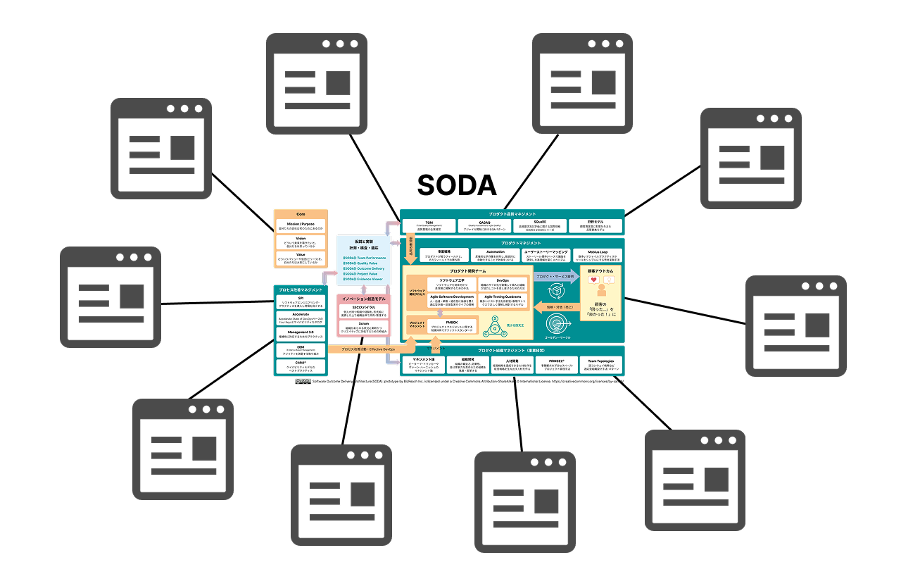

# インセプションデッキ：SODAコミュニティ活動

SODA Community にようこそ。この canvas には、このプロジェクトについて知っておくべきことすべてと、重要なリソースやメンバーへのリンクが含まれています。

---

## 我々はなぜここにいるのか？（Why are we here?）

SODA（Software Outcome Delivery Architecture）をインターネット上で公開し、さまざまなナレッジを誰もが参照できるようにします。SODAは、経営層・マネジャー・エンジニアが組織のケイパビリティを把握し、正確な経営判断と事業成長を支援するためのベース・フレームワークです。

SODAを利用することで：

- **経営層**: 的確な経営判断を行えるようになる  
- **マネジャー**: 組織の課題を発見し、適切な対策を講じられる  
- **エンジニア**: プロセス改善のヒントを得られる  

また、SODAはベースラインをリリース後、オープンソースの思想に則りGitHub上で管理します。コミュニティ主導のもと、アップデートに向けた議論もオープンにしながら持続的に発展させて行きます。

---

## DORA Core Model との差別化

- **DORA Core Model**  
  ソフトウェアデリバリーと運用のパフォーマンスを向上させるためのフレームワークで、  
  デプロイ頻度、変更リードタイム、変更失敗率、復旧時間という4つの主要指標を活用して、  
  組織のデリバリーパフォーマンスと安定性を評価します。

- **SODA**  
  プロダクト組織を構造的に捉え、可視化するフレームワークです。  
  自組織のケイパビリティの現状を把握し、足りない要素を特定し、  
  それを補うために何を学ぶべきかを導き出すヒントを提供します。  

SODAの特徴:

- 経営層・マネジャー・エンジニアが共通の理解を持てるフレームワーク  
- 単なる評価ツールではなく、組織の成長を促すアーキテクチャ  
- コミュニティ主導のナレッジ共有と継続的な改善プロセス  

---

## ゴール

- SODA フレームワーク公開サイトのオープン  
- SODAの認知拡大と発展  
- 持続的なSODAのアップデート  
- 多様な専門家が協力するコミュニティの確立  
- 組織の可視化と改善の促進  

---

## エレベーターピッチ

[1️⃣ SODAの認知を拡大し、組織の成長に貢献したい ] を満たしたい、  
[2️⃣ 経営層、マネジャー、エンジニア、プロセス改善担当者 ] 向けの、  
[3️⃣ SODAコミュニティ ] は、  
[4️⃣ SODAの普及と発展を推進するオープンなナレッジ共有プラットフォーム ] である。  

これは [5️⃣ 継続的なSODAのアップデートと業界横断的な知見の集約 ] ができる。  
[6️⃣ 企業単位での個別導入 ] とは違って、  
[7️⃣ 多様な専門家のコラボレーションと実践的なフィードバックの循環 ] が備わっている。  

そして [8️⃣ コミュニティの協力体制とオープン性 ] からこそ、  
[9️⃣ SODAの価値を最大限に引き出し、幅広い組織へ浸透 ] できる。  

> **エレベーターピッチの構成要素**
> 
> 1️⃣ 潜在的なニーズ／抱えている課題  
> 2️⃣ ターゲットユーザー  
> 3️⃣ プロダクト名  
> 4️⃣ プロダクトのカテゴリ  
> 5️⃣ 重要な利点、対価に見合う説得力のある理由  
> 6️⃣ 最も保守的な代替手段  
> 7️⃣ 差別化の決定的な特徴  
> 8️⃣ 実績や強み＋社名  
> 9️⃣ 自社が取り組む理由、圧倒的な優位性

---

## プロジェクトの特徴（Product box）

**キャッチフレーズ候補**
1. 組織の可能性を可視化する地図。SODAでエンジニアの視座を高めよう  
2. ソフトウェア組織の成功アーキテクチャ。SODAで見える、改善の道筋  
3. エンジニアと経営を接続、SODAで共有する組織の現在地  

**特徴・効能**

- 可視化: 組織の能力や課題を明確に把握  
- コラボレーション: 経営層・マネジャー・エンジニアが共通認識を持つ  
- 継続的アップデート: コミュニティで定期的に改善  

---

## 開発対象とするスコープ（The NOT list）

**やる（IN）**
- コミュニティ主導の運営  
- SODAの定期的なアップデート  
- 経営判断・組織改善の可視化モデル提供  
- SODAの認知向上（カンファレンス発表など）  
- コンテンツ提供言語：日本語と英語  

**やらない（OUT）**
- 日本版ウォーターフォールには合わせない  
- 特定企業向けのカスタマイズ  
- 一つの業界に特化したもの  
- 一度作ったら終わりの固定モデル  

**あとで決める（UNRESOLVED）**
- 国際展開（英語以外）  

---

## 優先事項の確認（Trade-off sliders）

| 項目                     | MIN |     |     |     |     | MAX |
|--------------------------|:---:|:---:|:---:|:---:|:---:|:---:|
| 機能をぜんぶ揃える（スコープ） |     |     |     |  ●  |     |     |
| 予算内に収める（予算）        |     |     |  ●  |     |     |     |
| 期日を死守する（時間）        |  ●  |     |     |     |     |     |
| 高い品質、少ない欠陥（品質）   |     |     |     |     |     |  ●  |
| 簡単にナレッジを探せる        |     |     |     |     |  ●  |     |
| コミュニティメンバーが増える   |     |  ●  |     |     |     |     |

---

## プロジェクト環境（Your project community）

**事務局**
- 主幹: 高橋 裕之（ファインディ）、外山 大（ビズリーチ）、内藤 靖子（KINTOテクノロジーズ）  
- メンバー: 佐々木 奈央、佐土原 弘和、谷内 栄樹（ビズリーチ）  

**参加企業・ステークホルダー**
- 株式会社ビズリーチ  
- ファインディ株式会社  
- KINTOテクノロジーズ株式会社  

---

## スケジュール（How big is this thing?）

**2025年の予定**

- コミュニティ立ち上げ: 1〜3月  
- SODA図アップデート: 2〜5月  
- 継続的な運用: 7〜12月  

---

## テクニカルソリューション（Technical solution）

- **知識共有**: GitHub, canvas  
- **コラボレーション**: Slack, Figma, Zoom  
- **フィードバック基盤**: GitHub Issues, レビュー  

---

## プロジェクトリスク（What keeps us up at night）

- 情報の透明性と守秘義務のバランス  
- 導入の障壁  
- コミュニティの継続性  
- 商標やブランドに関する問題  

---

## 何がどれだけ必要なのか（Show What It’s Going to Take）

- コアメンバー（3名）、サポートメンバー（2名）  
- 運営費（Webサイト維持費 TBD）  
